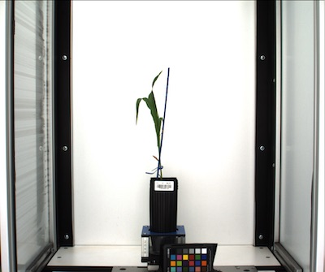
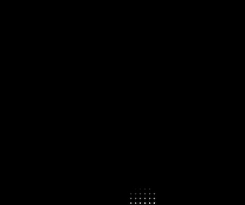

## Create a Labeled Color Card Mask

Creates a uniquely labeled mask for each color chip based on user-defined positioning.

**plantcv.transform.create_color_card_mask**(*(rgb_img, radius, start_coord, spacing, nrows, ncols, exclude=[]*)

**returns** mask

- **Parameters**
    - rgb_img        - Input RGB image data containing a color card.
    - radius         - Radius of color masks.
    - start_coord    - Two-element tuple of the first chip mask starting x and y coordinate.
    - spacing        - Two-element tuple of the horizontal and vertical spacing between chip masks.
    - nrows          - Number of chip rows.
    - ncols          - Number of chip columns.
    - exclude        - Optional list of chips to exclude.
- **Returns**
    - mask           - Labeled mask of chips. The first chip is labeled with the value 0, then 10, 20, and so on.
    
```python
from plantcv import plantcv as pcv

rgb_img, path, filename = pcv.readimage("target_img.png")

mask = pcv.transform.create_color_card_mask(rgb_img=img, radius=10, start_coord=(400,600), spacing=(30,30), ncols=6, nrows=4)

```

**Image with color card**



**Image with color chip ROIs**


**Color card mask**


