## Tutorial: NIR Image Workflow

PlantCV is composed of modular functions that can be arranged (or rearranged) and adjusted quickly and easily. 
We hope that you can use these functions and workflows as a starting place for your project. 
The goal is to provide practical examples of image processing algorithms.

Workflows do not need to be linear (and often as are not, as seen in this example).
A global variable "debug" allows the user to print out the resulting image.
The debug has three modes: either None, 'plot', or 'print'. If set to
'print' then the function prints the image out, or if using a [Jupyter](jupyter.md) notebook you could set debug to 'plot' to have
the images plot to the screen. Debug mode allows users to visualize and optimize each step on individual test images
and small test sets before workflows are deployed over whole datasets.

[](https://mybinder.org/v2/gh/danforthcenter/plantcv-binder.git/master?filepath=notebooks/nir_tutorial.ipynb) Check out our interactive NIR tutorial! 

Also see [here](#nir-script) for the complete script. 

### Workflow
1.  Optimize workflow on individual image with debug set to 'print' (or 'plot' if using a Jupyter notebook).
2.  Run workflow on small test set (that ideally spans time and/or treatments).
3.  Re-optimize workflows on 'problem images' after manual inspection of test set.
4.  Deploy optimized workflow over test set using parallelization script.

### Running A Workflow

To run a NIR Workflow over a single NIR image there are three required inputs:

1.  **Image:** NIR images are grayscale matrices (1 signal dimension).
In principle, image processing will work on any grayscale image with adjustments if images are well lit and
there is appreciable contrast difference between the object of interest and the background.
2.  **Output directory:** If debug mode is set to 'print' output images from each intermediate step are produced.
3.  **Image of estimated background:** Right now this is hardcoded into the Workflow (different background at each zoom level) and not implemented as an argument.

Optional inputs:  

*  **Debug Flag:** Prints an image at each step
*  **Region of Interest:** The user can input their own binary region of interest or image mask (make sure it is the same size as your image or you will have problems).

Sample command to run a Workflow on a single image:  

*  Always test Workflows (preferably with -D flag set to 'print') before running over a full image set

```
./Workflowname.py -i /home/user/images/testimg.png -o /home/user/output-images -D 'print'

```


### Walk through a sample Workflow

#### Workflows start by importing necessary packages, and by defining user inputs.

```python
#!/usr/bin/env python
import os, sys, traceback
import cv2
import numpy as np
import argparse
import string
from plantcv import plantcv as pcv

def options():
    parser = argparse.ArgumentParser(description="Imaging processing with opencv")
    parser.add_argument("-i", "--image", help="Input image file.", required=True)
    parser.add_argument("-m", "--roi", help="Input region of interest file.", required=False)
    parser.add_argument("-o", "--outdir", help="Output directory for image files.", required=False)
    parser.add_argument("-D", "--debug", help="Turn on debug, prints intermediate images.", action="store_true")
    args = parser.parse_args()
    return args
    
```

#### Start of the Main/Customizable portion of the Workflow.

The image selected by the -i flag is [read](read_image.md) in.

Lets start by using a background subtraction approach to object identification

```python
### Main Workflow
def main():
    # Get options
    args = options()
    
    pcv.params.debug = args.debug #set debug mode
    pcv.params.debug_outdir = args.outdir #set output directory
    
    # Read image (Note: flags=0 indicates to expect a grayscale image)
    img, path, img_name = pcv.readimage(args.image)
    
    # Read in image which is the pixelwise average of background images
    img_bkgrd, bkgrdpath, bkgrdname = pcv.readimage(filename="background_nir_z2500.png")
    
```

**Figure 1.** (Top) Original image. (Bottom) Background average image.

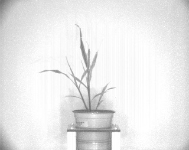

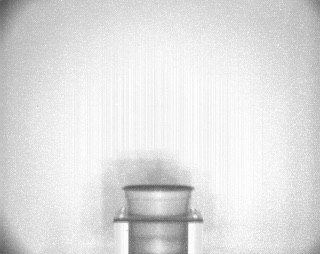

First, let's examine how efficiently we can capture the plant. Then we will worry about masking problematic background objects.
We start by [subtracting](image_subtract.md) the background.

```python
    # Subtract the background image from the image with the plant.
    
    # Inputs: 
    #   gray_img1 - Grayscale image data from which gray_img2 will be subtracted
    #   gray_img2 - Grayscale image data which will be subtracted from gray_img1
    bkg_sub_img = pcv.image_subtract(gray_img1=img_bkgrd, gray_img2=img)
        
    # Threshold the image of interest using the two-sided custom range function (keep what is between 20-190)
    
    # Inputs:
    #   img - RGB or grayscale image data 
    #   lower_thresh - List of lower threshold values 
    #   upper_thresh - List of upper threshold values
    #   channel - Color-space channels of interest (either 'RGB', 'HSV', 'LAB', or 'gray')
    bkg_sub_thres_img, masked_img = pcv.threshold.custom_range(img=bkg_sub_img, lower_thresh=[20], 
                                                               upper_thresh=[250], channel='gray')

```

**Figure 2.** (Top) Image after subtraction of average background pixels. (Bottom) Image after two-sided thresholding applied to isolate plant material.

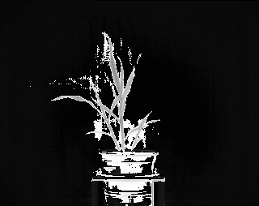

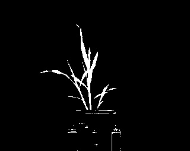

Images were subtracted using the PlantCV [image subtract](image_subtract.md) function.
This function is built using the numpy '-' operator.
It is a modulo operator rather than a saturation operator.

Thresholding was done using the [custom range threshold](custom_range_threshold.md) function. Pixels that have a signal value less than 20 and greater than 250 will be set to 0 (black), 
while those with a value between these two will be set to 255 (white).
This approach works very well if you have image of the background without plant material.

We can use the [Laplace filter](laplace_filter.md), an image sharpening approach, to improve object of interest thresholding.
This will improve your ability to maximize
the amount of plant material captured, and it is particularly useful if estimating background pixel intensity is problematic.

```python
    # Laplace filtering (identify edges based on 2nd derivative)

    # Inputs:
    #   gray_img - Grayscale image data 
    #   ksize - Aperture size used to calculate the second derivative filter, 
    #           specifies the size of the kernel (must be an odd integer)
    #   scale - Scaling factor applied (multiplied) to computed Laplacian values 
    #           (scale = 1 is unscaled) 
    lp_img = pcv.laplace_filter(gray_img=img, ksize=1, scale=1)

    # Plot histogram of grayscale values 
    hist1 = pcv.visualize.histogram(img=lp_img)

    # Lapacian image sharpening, this step will enhance the darkness of the edges detected
    lp_shrp_img = pcv.image_subtract(gray_img1=img, gray_img2=lp_img)

    # Plot histogram of grayscale values, this helps to determine thresholding value 
    hist2 = pcv.visualize.histogram(img=lp_shrp_img)

```

**Figure 3.** (Top) Result after second derivative Laplacian filter is applied to the original grayscale image.
(Bottom) Result after subtracting the Laplacian filtered image from the original image (sharpening).


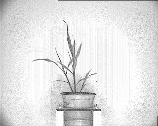

Subtracting this filtered image from the original image will increase the contrast between plant and background if the border between the two objects is distinct.
Notice the plant is darker in this image than it was in the original image. We can apply the [Sobel filter](sobel_filter.md) to each axis. Then we use the
[image addition](image_add.md) function to combine the results of each filter.

```python
    # Sobel filtering
    # 1st derivative sobel filtering along horizontal axis, kernel = 1)
    
    # Inputs: 
    #   gray_img - Grayscale image data 
    #   dx - Derivative of x to analyze 
    #   dy - Derivative of y to analyze 
    #   ksize - Aperture size used to calculate 2nd derivative, specifies the size of the kernel and must be an odd integer
    # NOTE: Aperture size must be greater than the largest derivative (ksize > dx & ksize > dy) 
    sbx_img = pcv.sobel_filter(gray_img=img, dx=1, dy=0, ksize=1)
    
    # 1st derivative sobel filtering along vertical axis, kernel = 1)
    sby_img = pcv.sobel_filter(gray_img=img, dx=0, dy=1, ksize=1)
    
    # Combine the effects of both x and y filters through matrix addition
    # This will capture edges identified within each plane and emphasize edges found in both images
    
    # Inputs:
    #   gray_img1 - Grayscale image data to be added to gray_img2
    #   gray_img2 - Grayscale image data to be added to gray_img1
    sb_img = pcv.image_add(gray_img1=sbx_img, gray_img2=sby_img)

```

**Figure 4.** From top to bottom: Result after first derivative Sobel filter is applied to the x-axis of the original image;
Result after first derivative Sobel filter is applied to the y-axis of the original image;
Result after adding the two Sobel filtered images together.

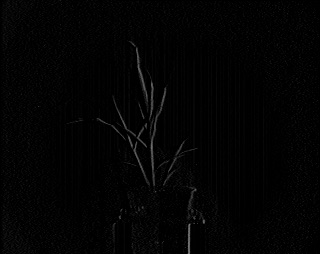

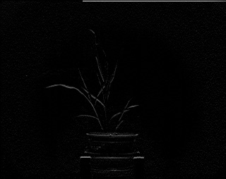


First derivative Sobel filters highlight more ambiguous boundaries within the image. These are applied across each axis individually.
Combining both Sobel filters images through addition highlights these regions where the texture changes across both axes.

Next, we apply the [median blur](median_blur.md) function to smooth the image, and then [invert](invert.md) the image. We then [add](image_add.md) the images
together and use the [binary threshold](binary_threshold.md) function.

```python
    # Use a lowpass (blurring) filter to smooth sobel image
    
    # Inputs:
    #   gray_img - Grayscale image data 
    #   ksize - Kernel size (integer or tuple), (ksize, ksize) box if integer input,
    #           (n, m) box if tuple input 
    mblur_img = pcv.median_blur(gray_img=sb_img, ksize=1)

    # Inputs:
    #   gray_img - Grayscale image data 
    mblur_invert_img = pcv.invert(gray_img=mblur_img)
    
    # combine the smoothed sobel image with the laplacian sharpened image
    # combines the best features of both methods as described in "Digital Image Processing" by Gonzalez and Woods pg. 169
    edge_shrp_img = pcv.image_add(gray_img1=mblur_invert_img, gray_img2=lp_shrp_img)
    
    # Perform thresholding to generate a binary image
    tr_es_img = pcv.threshold.binary(gray_img=edge_shrp_img, threshold=145, 
                                     max_value=255, object_type='dark')

```

**Figure 5.** From top to bottom: Median blur;
Sobel filtered image after application of a median blur filter and inversion;
Resulting image after adding the image on the right to the Laplacian sharpened image;
Resulting image after binary thresholding of sharpened image.

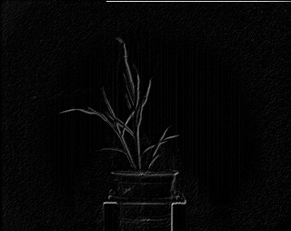

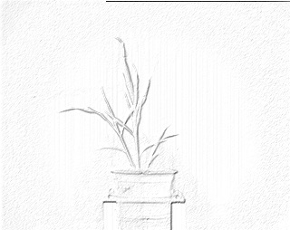

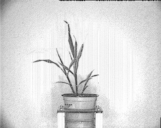


Median blur filtering decreases the amount of noise present in Sobel filtered images.
Adding this (inverted, Sobel filtered) image to the Laplacian filtered image further increases the contrast between the plant and background.
Increased contrast enables effective binary thresholding.

Next, we [erode](erode.md) the image to reduce noise.

```python
    # Do erosion with a 3x3 kernel (ksize=3)
    
    # Inputs:
    #   gray_img - Grayscale (usually binary) image data 
    #   ksize - The size used to build a ksize x ksize 
    #            matrix using np.ones. Must be greater than 1 to have an effect 
    #   i - An integer for the number of iterations 
    e1_img = pcv.erode(gray_img=tr_es_img, ksize=3, i=1)

```

**Figure 6.** Erosion with a 3x3 kernel.

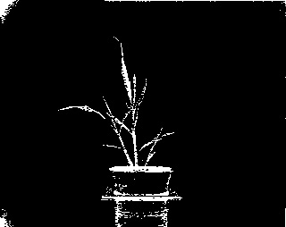

Erosion steps help eliminate background noise (pixels called plant that are isolated and are part of background).
The focal pixel (one in the middle of the 3X3 grid) is retained if the corresponding other pixel in the kernel non zero.

Merging results from both the background subtraction and derivative filter methods is better at capturing the object (plant) than either method alone. We achieve
this with the [logical or](logical_or.md) function. Then we [apply the mask](apply_mask.md).

```python
    # Bring the two object identification approaches together.
    # Using a logical OR combine object identified by background subtraction and the object identified by derivative filter.
    
    # Inputs: 
    #   bin_img1 - Binary image data to be compared in bin_img2
    #   bin_img2 - Binary image data to be compared in bin_img1
    comb_img = pcv.logical_or(bin_img1=e1_img, bin_img2=bkg_sub_thres_img)
    
    # Get masked image, Essentially identify pixels corresponding to plant and keep those.
    
    # Inputs: 
    #   rgb_img - RGB image data 
    #   mask - Binary mask image data 
    #   mask_color - 'black' or 'white'
    masked_erd = pcv.apply_mask(img=img, mask=comb_img, mask_color='black')

```

**Figure 7.** (Top) Logical join between binary images.
(Bottom) Original image masked with binary derived from the logical join of both methods.

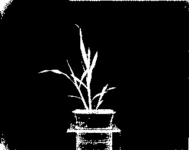

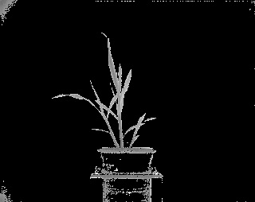

The [background subtract](background_subtraction.md) method does a good job of identifying most of the plant but not so good where leaves meet stem.
The derivative filter method does a good job of identifying edges of the plant but not so good identifying interior of leaves.
Combining these methods improves our ability to capture more plant and less background.

We can remove unwanted parts of the image using a [rectangular mask](rectangle_mask.md) function.

```python
    # Need to remove the edges of the image, we did that by generating a set of rectangles to mask the edges
    # img is (254 X 320)
    # mask for the bottom of the image
    
    # Inputs:
    #   img - RGB or grayscale image data 
    #   p1 - Point at the top left corner of the rectangle (tuple)
    #   p2 - Point at the bottom right corner of the rectangle (tuple) 
    #   color 'black' (default), 'gray', or 'white'
    masked1, box1_img, rect_contour1, hierarchy1 = pcv.rectangle_mask(img=img, p1=(120,184), 
                                                                      p2=(215,252))
    # mask for the left side of the image
    masked2, box2_img, rect_contour2, hierarchy2 = pcv.rectangle_mask(img=img, p1=(1,1),
                                                                      p2=(85,252))
    # mask for the right side of the image
    masked3, box3_img, rect_contour3, hierarchy3 = pcv.rectangle_mask(img=img, p1=(240,1),
                                                                      p2=(318,252))
    # mask the edges
    masked4, box4_img, rect_contour4, hierarchy4 = pcv.rectangle_mask(img=img, p1=(1,1), 
                                                                      p2=(318,252))

```

**Figure 8.** Use rectangle masks to remove parts of the image.
From top to bottom: Make a mask to hide the pot; Make a mask to hide left panel;
Make a mask to hide right panel; Make a mask to hide the edges of the image.

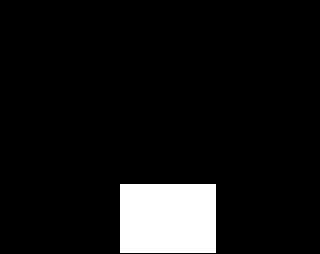

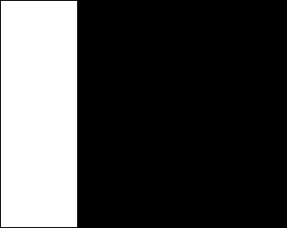

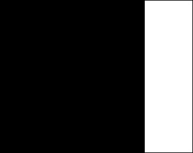

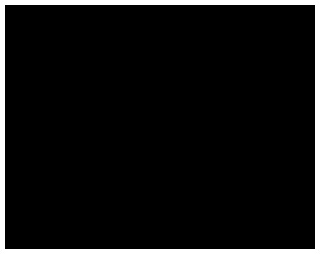

Making image masks is a very useful method to ignore/remove objects in your image that are difficult to remove through thresholding.
Note that the top left corner has coordinate values (1,1) and these coordinate values increase as you move right and down (row, column).

Next, we use the [logical or](logical_or.md) function to combine the masks. Then the mask is [inverted](invert.md) and [applied](apply_mask.md) to the image.

```python
    # combine boxes to filter the edges and car out of the photo
    bx12_img = pcv.logical_or(bin_img1=box1_img, bin_img2=box2_img)
    bx123_img = pcv.logical_or(bin_img1=bx12_img, bin_img2=box3_img)
    bx1234_img = pcv.logical_or(bin_img1=bx123_img, bin_img2=box4_img)
    
    # invert this mask and then apply it the masked image.
    inv_bx1234_img = pcv.invert(gray_img=bx1234_img)
    edge_masked_img = pcv.apply_mask(img=masked_erd, mask=inv_bx1234_img, 
                                     mask_color='black')

```

**Figure 9.** (Top) Combined background masks after inversion. (Bottom) Masked image from above after masking with background mask.

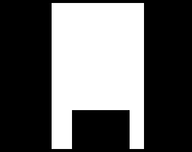

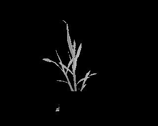

Note the plant is almost entirely isolate from the background. Now we use the [find objects](find_objects.md) function to find
contours of the plant. We define a [rectangular region of interest](roi_rectangle.md) to capture only the objects (contours) that are partially
within the ROI.

```python

    # Identify objects
    
    # Inputs:
    #   img - RGB or grayscale image data for plotting
    #   mask - Binary mask used for detecting contours
    id_objects,obj_hierarchy = pcv.find_objects(img=edge_masked_img, mask=inv_bx1234_img)
    
    # Define ROI
    
    # Inputs: 
    #   img - RGB or grayscale image to plot the ROI on 
    #   x - The x-coordinate of the upper left corner of the rectangle 
    #   y - The y-coordinate of the upper left corner of the rectangle 
    #   h - The height of the rectangle 
    #   w - The width of the rectangle 
    roi1, roi_hierarchy= pcv.roi.rectangle(img=edge_masked_img, x=100, y=100, h=200, w=200)
    
    # Decide which objects to keep
    
    # Inputs:
    #    img            = img to display kept objects
    #    roi_contour    = contour of roi, output from any ROI function
    #    roi_hierarchy  = contour of roi, output from any ROI function
    #    object_contour = contours of objects, output from pcv.find_objects function
    #    obj_hierarchy  = hierarchy of objects, output from pcv.find_objects function
    #    roi_type       = 'partial' (default, for partially inside), 'cutto', or 
    #    'largest' (keep only largest contour)
    roi_objects, hierarchy5, kept_mask, obj_area = pcv.roi_objects(img=edge_masked_img, 
                                                                   roi_contour=roi1, 
                                                                   roi_hierarchy=roi_hierarchy, 
                                                                   object_contour=id_objects, 
                                                                   obj_hierarchy=obj_hierarchy, 
                                                                   roi_type='partial')

```

**Figure 10.** (Top) Select an area where you expect the plant to be.
(Bottom) Plant falls within area so include all continuous portions within the plant that fall within the area of interest (rectangle).

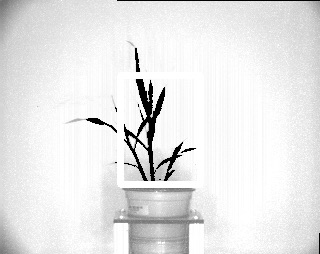

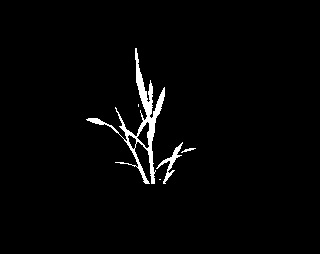

We can use the [object composition](object_composition.md) function to outline the plant.

```python

    # Inputs:
    #   img - RGB or grayscale image data for plotting 
    #   contours - Contour list 
    #   hierarchy - Contour hierarchy array 
    o, m = pcv.object_composition(img=img, contours=roi_objects, hierarchy=hierarchy5)

```

**Figure 11.** This is an outline of the contours of the captured plant drawn onto the original image.

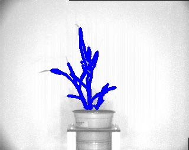

Now that the plant has been separated from the background we can analyze the pixel composition and shape of the plant.
To [pseudocolor](visualize_pseudocolor.md) a plant by pixel intensity can take very few parameters but offers a lot 
of customization since it is intended to just make figures. 
All masks, countours, etc... need to be converted to 3-dimensions for pseudocoloring.

Now we can perform the [analysis of pixelwise signal value](analyze_NIR_intensity.md) and object [shape](analyze_shape.md) attributes.

```python
### Analysis ###

    outfile = False
    if args.writeimg == True:
        outfile = os.path.join(args.outdir, filename)
    
    # Perform signal analysis
    
    # Inputs: 
    #   gray_img - 8 or 16-bit grayscale image data 
    #   mask - Binary mask made from selected contours 
    #   bins - Number of classes to divide the spectrum into 
    #   histplot - If True, plots the histogram of intensity values 
    #   label - Optional label parameter, modifies the variable name of observations recorded. (default `label="default"`)
    nir_hist = pcv.analyze_nir_intensity(gray_img=img, mask=kept_mask, 
                                         bins=256, histplot=True, label="default")
    
    # Pseudocolor the grayscale image to a colormap
    
    # Inputs:
    #     gray_img - Grayscale image data
    #     obj - Single or grouped contour object (optional), if provided the pseudocolored image gets cropped down to the region of interest.
    #     mask - Binary mask (optional) 
    #     background - Background color/type. Options are "image" (gray_img), "white", or "black". A mask must be supplied.
    #     cmap - Colormap
    #     min_value - Minimum value for range of interest
    #     max_value - Maximum value for range of interest
    #     dpi - Dots per inch for image if printed out (optional, if dpi=None then the default is set to 100 dpi).
    #     axes - If False then the title, x-axis, and y-axis won't be displayed (default axes=True).
    #     colorbar - If False then the colorbar won't be displayed (default colorbar=True)
    pseudocolored_img = pcv.visualize.pseudocolor(gray_img=img, mask=kept_mask, cmap='viridis')
    
    # Perform shape analysis
    
    # Inputs:
    #   img - RGB or grayscale image data 
    #   obj- Single or grouped contour object
    #   mask - Binary image mask to use as mask for moments analysis 
    #   label - Optional label parameter, modifies the variable name of observations recorded. (default `label="default"`)
    shape_imgs = pcv.analyze_object(img=img, obj=o, mask=m, label="default")
    
    # Write shape and nir data to results file
    pcv.outputs.save_results(filename=args.result)
    
# Call program
if __name__ == '__main__':
    main()
    
```

**Figure 12.** From top to bottom: A image of the object pseudocolored by signal intensity (darker green is more black, yellow is more white); 
Shape attributes of the plant printed on the original image; Histogram of the signal intensity values.


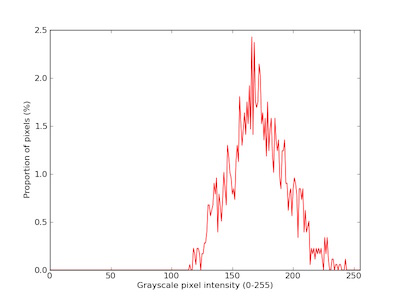

To deploy a Workflow over a full image set please see tutorial on [Workflow parallelization](pipeline_parallel.md).

## NIR Script 

In the terminal:

```
./Workflowname.py -i /home/user/images/testimg.png -o /home/user/output-images -D 'print'

```

*  Always test Workflows (preferably with -D flag set to 'print') before running over a full image set

Python script:

```python
#!/usr/bin/env python
import os
import argparse
from plantcv import plantcv as pcv


def options():
    parser = argparse.ArgumentParser(description="Imaging processing with opencv")
    parser.add_argument("-i", "--image", help="Input image file.", required=True)
    parser.add_argument("-m", "--roi", help="Input region of interest file.", required=False)
    parser.add_argument("-o", "--outdir", help="Output directory for image files.", required=False)
    parser.add_argument("-D", "--debug", help="Turn on debug, prints intermediate images.", action="store_true")
    args = parser.parse_args()
    return args


### Main Workflow
def main():
    # Get options
    args = options()

    pcv.params.debug = args.debug  # set debug mode
    pcv.params.debug_outdir = args.outdir  # set output directory

    img, path, img_name = pcv.readimage(filename=args.image)

    # Read in image which is the pixelwise average of background images
    img_bkgrd, bkgrdpath, bkgrdname = pcv.readimage("background_nir_z2500.png")

    # Subtract the background image from the image with the plant.
    bkg_sub_img = pcv.image_subtract(gray_img1=img, gray_img2=img_bkgrd)

    # Threshold the image of interest using the two-sided custom range function (keep what is between 50-190)
    bkg_sub_thres_img = pcv.threshold.custom_range(img=bkg_sub_img, lower_thresh=[50],
                                                   upper_thresh=[190], channel='gray')

    # Laplace filtering (identify edges based on 2nd derivative)
    lp_img = pcv.laplace_filter(gray_img=img, ksize=1, scale=1)
    pcv.visualize.histogram(lp_img)

    # Lapacian image sharpening, this step will enhance the darkness of the edges detected
    lp_shrp_img = pcv.image_subtract(gray_img1=img, gray_img2=lp_img)
    pcv.visualize.histogram()

    # Sobel filtering
    # 1st derivative sobel filtering along horizontal axis, kernel = 1)
    sbx_img = pcv.sobel_filter(gray_img=img, dx=1, dy=0, ksize=1)

    # 1st derivative sobel filtering along vertical axis, kernel = 1)
    sby_img = pcv.sobel_filter(gray_img=img, dx=0, dy=1, ksize=1)

    # Combine the effects of both x and y filters through matrix addition
    # This will capture edges identified within each plane and emphasize edges found in both images
    sb_img = pcv.image_add(gray_img1=sbx_img, gray_img2=sby_img)

    # Use a lowpass (blurring) filter to smooth sobel image
    mblur_img = pcv.median_blur(gray_img=sb_img, ksize=1)
    mblur_invert_img = pcv.invert(gray_img=mblur_img)

    # combine the smoothed sobel image with the laplacian sharpened image
    # combines the best features of both methods as described in "Digital Image Processing" by Gonzalez and Woods pg. 169
    edge_shrp_img = pcv.image_add(gray_img1=mblur_invert_img, gray_img2=lp_shrp_img)

    # Perform thresholding to generate a binary image
    tr_es_img = pcv.threshold.binary(gray_img=edge_shrp_img, threshold=145,
                                     max_value=255, object_type='dark')

    # Do erosion with a 3x3 kernel
    e1_img = pcv.erode(gray_img=tr_es_img, ksize=3, i=1)

    # Bring the two object identification approaches together.
    # Using a logical OR combine object identified by background subtraction and the object identified by derivative filter.
    comb_img = pcv.logical_or(bin_img1=e1_img, bin_img2=bkg_sub_thres_img)

    # Get masked image, Essentially identify pixels corresponding to plant and keep those.
    masked_erd = pcv.apply_mask(img=img, mask=comb_img, mask_color='black')

    # Need to remove the edges of the image, we did that by generating a set of rectangles to mask the edges
    # img is (254 X 320)
    # mask for the bottom of the image
    masked1, box1_img, rect_contour1, hierarchy1 = pcv.rectangle_mask(img=img, p1=(120, 184), p2=(215, 252))
    # mask for the left side of the image
    masked2, box2_img, rect_contour2, hierarchy2 = pcv.rectangle_mask(img=img, p1=(1, 1), p2=(85, 252))
    # mask for the right side of the image
    masked3, box3_img, rect_contour3, hierarchy3 = pcv.rectangle_mask(img=img, p1=(240, 1), p2=(318, 252))
    # mask the edges
    masked4, box4_img, rect_contour4, hierarchy4 = pcv.rectangle_mask(img=img, p1=(1, 1), p2=(318, 252))

    # combine boxes to filter the edges and car out of the photo
    bx12_img = pcv.logical_or(bin_img1=box1_img, bin_img2=box2_img)
    bx123_img = pcv.logical_or(bin_img1=bx12_img, bin_img2=box3_img)
    bx1234_img = pcv.logical_or(bin_img1=bx123_img, bin_img2=box4_img)

    # invert this mask and then apply it the masked image.
    inv_bx1234_img = pcv.invert(gray_img=bx1234_img)
    edge_masked_img = pcv.apply_mask(img=masked_erd, mask=inv_bx1234_img, mask_color='black')

    # Identify objects
    id_objects, obj_hierarchy = pcv.find_objects(img=edge_masked_img, mask=inv_bx1234_img)

    # Define ROI
    roi1, roi_hierarchy = pcv.roi.rectangle(img=edge_masked_img, x=100, y=100, h=200, w=200)

    # Decide which objects to keep
    roi_objects, hierarchy5, kept_mask, obj_area = pcv.roi_objects(img=edge_masked_img,
                                                                   roi_contour=roi1,
                                                                   roi_hierarchy=roi_hierarchy,
                                                                   object_contour=id_objects,
                                                                   obj_hierarchy=obj_hierarchy,
                                                                   roi_type='partial')

    o, m = pcv.object_composition(img=img, contours=roi_objects, hierarchy=hierarchy5)

    ### Analysis ###

    outfile = False
    if args.writeimg == True:
        outfile = os.path.join(args.outdir, img_name)

    # Perform signal analysis
    nir_hist = pcv.analyze_nir_intensity(gray_img=img, mask=kept_mask, bins=256, histplot=True, label="default")

    # Pseudocolor the grayscale image to a colormap
    pseudocolored_img = pcv.visualize.pseudocolor(gray_img=img, mask=kept_mask, cmap='viridis')

    # Perform shape analysis
    shape_imgs = pcv.analyze_object(img=img, obj=o, mask=m, label="default")

    # Write shape and nir data to results file
    pcv.outputs.save_results(filename=args.result)


# Call program
if __name__ == '__main__':
    main()

```
