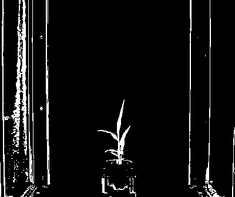

## Otsu Auto Threshold

Creates a binary image from a gray image based on the threshold values. 

**plantcv.threshold.otsu**(*gray_img, max_value, object_type="light"*)

**returns** thresholded/binary image

- **Parameters:**
    - gray_img - Grayscale image data
    - max_value - Value to apply above threshold (255 = white)
    - object_type - "light" or "dark" (default: "light"). If object is lighter than the background then standard 
    thresholding is done. If object is darker than the background then inverse thresholding is done.
   
- **Context:**
    - Used to help differentiate plant and background

**Grayscale image (green-magenta channel)**


```python
from plantcv import plantcv as pcv

# Set global debug behavior to None (default), "print" (to file), 
# or "plot" (Jupyter Notebooks or X11)
pcv.params.debug = "print"

# Create binary image from a gray image based on threshold values. 
# Targeting light objects in the image.
threshold_light = pcv.threshold.otsu(gray_img=gray_img, max_value=255, object_type='dark')

```

**Thresholded image**



**Grayscale image (blue-yellow channel)**


```python

# Create binary image from a gray image based on threshold values. 
# Targeting dark objects in the image.
threshold_dark = pcv.threshold.otsu(gray_img=gray_img, max_value=255, object_type='light')

```

**Thresholded image (inverse)**


**Source Code:** [Here](https://github.com/danforthcenter/plantcv/blob/master/plantcv/plantcv/threshold/threshold_methods.py)
