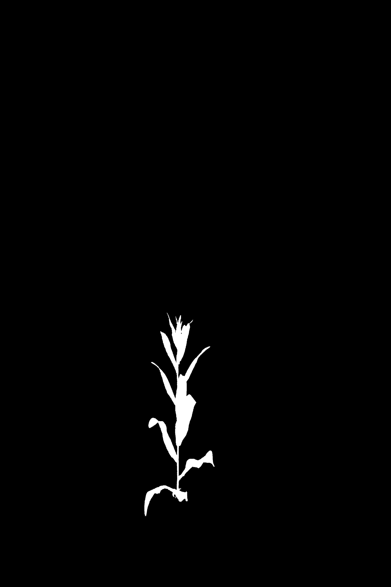
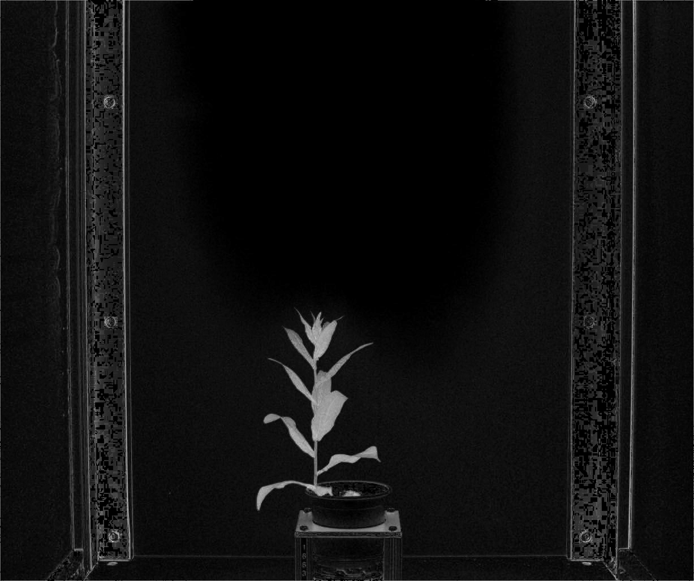

## Warp

Performs a perspective warp based on ground control points to align images

**plantcv.transform.warp**(*img, refimg, pts, refpts, method="default"*)

**returns** image after warping

- **Parameters:**
    - img - binary or grayscale image to warp
    - refimg - image used as a reference for the warp
    - pts - coordinate points on `img`. 4 pairs should be given as a list of tuples
    - refpts - corresponding coordinate points on `refimg`. 4 pairs should be given as a list of tuples
    - method - method of calculating the transformation matrix. Available options are 'default', 'ransac', 'lmeds', 'rho' which correspond to the opencv methods and [vary based on how they handle outlier points](https://docs.opencv.org/3.4/d9/d0c/group__calib3d.html#ga4abc2ece9fab9398f2e560d53c8c9780)
- **Context:**
    - Warps an image without preserving parallel lines. Read about different transformations at [OpenCV](https://docs.opencv.org/3.4/da/d6e/tutorial_py_geometric_transformations.html)
- **Example use:**

A mask derived from a RGB image can be used to segment an NIR image which is difficult to segment otherwise.

**Input image**

A mask derived from a RGB image 2056x2454



An image from a SWIR camera is used as the reference image to define the transformation is 7000x5000



In this case we know the field of view of the two images is the same so we can use the image corners to define the transformation. In other cases you might need to establish corresponding control points in each image.

```python

from plantcv import plantcv as pcv

# Set global debug behavior to None (default), "print" (to file),
# or "plot" (Jupyter Notebooks or X11)
mrow, mcol = mask.shape
vrow, vcol, vdepth = grayimg.shape

img_warped = pcv.transform.warp(img=mask,
                                refimg=grayimg,
                                pts = [(0,0),(mcol-1,0),(mcol-1,mrow-1),(0,mrow-1)],
                                refpts = [(0,0),(vcol-1,0),(vcol-1,vrow-1),(0,vrow-1)]),
                                method='default')


```
Here is the warped mask:


Here is the warped mask overlayed on the reference image:


**Source Code:** [Here](https://github.com/danforthcenter/plantcv/blob/master/plantcv/plantcv/transform/warp.py)
