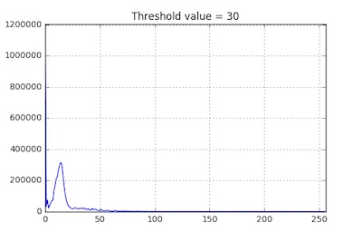
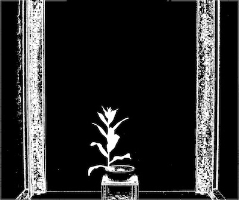

## Triangle Auto Threshold

Creates a binary image from a gray image using adaptive thresholding.

**plantcv.threshold.triangle**(*gray_img, max_value, object_type="light", xstep=1*)

**returns** thresholded/binary image

- **Parameters:**
    - gray_img - Grayscale image data
    - max_value - Value to apply above threshold (255 = white)
    - object_type - "light" or "dark" (default: "light"). If object is lighter than the background then standard 
    thresholding is done. If object is darker than the background then inverse thresholding is done.
    - xstep - Value to move along x-axis to determine the points from which to calculate distance
              recommended to start at 1 (default) and change if needed.
- **Context:**
    - Used to help differentiate plant and background
    

**Grayscale image (green-magenta channel)**


```python

from plantcv import plantcv as pcv

# Set global debug behavior to None (default), "print" (to file), 
# or "plot" (Jupyter Notebooks or X11)
pcv.params.debug = "print"

# Create binary image from a gray image based
thresholded = pcv.threshold.triangle(gray_img=gray_img, max_value=255, object_type='light', xstep=10)

```

**Triangle Auto-Thresholded image (xstep=10)**





```python

# Create binary image from a gray image based 
thresholded = pcv.threshold.triangle(gray_img=gray_img, max_value=255, object_type='light', xstep=1)

```

**Triangle Auto-Thresholded image (xstep=1)**


**Source Code:** [Here](https://github.com/danforthcenter/plantcv/blob/master/plantcv/plantcv/threshold/threshold_methods.py)
