## Tutorial: VIS/NIR Dual Image Workflow

PlantCV is composed of modular functions that can be arranged (or rearranged) and adjusted quickly and easily.
Workflows do not need to be linear (and often are not). Please see workflow example below for more details.
A global variable "debug" allows the user to print out the resulting image. The debug has three modes: either None, 'plot', or 'print'. If set to
'print' then the function prints the image out, if using a [Jupyter](jupyter.md) notebook, you could set debug to 'plot' to have
the images plot to the screen. Debug mode allows users to visualize and optimize each step on individual test images and small test sets before workflows are deployed over whole datasets.

For dual VIS/NIR workflows, a visible image is used to identify an image mask for the plant material.
The [get nir](get_nir.md) function is used to get the NIR image that matches the VIS image (must be in same folder,
with similar naming scheme), then functions are used to size and place the VIS image mask over the NIR image.
This allows two workflows to be done at once and also allows plant material to be identified in low-quality images.
We do not recommend this approach if there is a lot of plant movement between capture of NIR and VIS images.

[](https://mybinder.org/v2/gh/danforthcenter/plantcv-binder.git/master?filepath=notebooks/vis_nir_tutorial.ipynb) Check out our interactive VIS/NIR tutorial! 

Also see [here](#vis-nir-script) for the complete script. 

**Workflow**

1.  Optimize workflow on individual image with debug set to 'print' (or 'plot' if using a Jupyter notebook).
2.  Run workflow on small test set (ideally that spans time and/or treatments).
3.  Re-optimize workflows on 'problem images' after manual inspection of test set.
4.  Deploy optimized workflow over test set using parallelization script.

**Running A Workflow**

To run a VIS/NIR workflow over a single VIS image there are two required inputs:

1.  **Image:** Images can be processed regardless of what type of VIS camera was used (high-throughput platform, digital camera, cell phone camera).
Image processing will work with adjustments if images are well lit and free of background that is similar in color to plant material.  
2.  **Output directory:** If debug mode is set to 'print' output images from each intermediate step are produced, otherwise ~4 final output images are produced.

Optional inputs:  

*  **Result File:** File to print results to.
*  **CoResult File:** File to print co-results (NIR results) to.
*  **Write Image Flag:** Flag to write out images, otherwise no result images are printed (to save time).
*  **Debug Flag:** Prints an image at each step.
*  **Region of Interest:** The user can input their own binary region of interest or image mask (make sure it is the same size as your image or you will have problems).

Sample command to run a workflow on a single image:  

*  Always test workflows (preferably with -D 'print' option) before running over a full image set

```
./workflowname.py -i testimg.png -o ./output-images -r results.txt -w -D 'print'

```

### Walk Through A Sample Workflow

#### Workflows start by importing necessary packages, and by defining user inputs.

```python
#!/usr/bin/env python
import os
import sys, traceback
import cv2
import numpy as np
import argparse
import string
from plantcv import plantcv as pcv

### Parse command-line arguments
def options():
    parser = argparse.ArgumentParser(description="Imaging processing with opencv")
    parser.add_argument("-i", "--image", help="Input image file.", required=True)
    parser.add_argument("-o", "--outdir", help="Output directory for image files.", required=False)
    parser.add_argument("-r","--result", help="result file.", required= False )
    parser.add_argument("-r2","--coresult", help="result file.", required= False )
    parser.add_argument("-w","--writeimg", help="write out images.", default=False)
    parser.add_argument("-D", "--debug", help="Turn on debug, prints intermediate images.", default=None)
    args = parser.parse_args()
    return args
    
```

#### Start of the Main/Customizable portion of the workflow.

The image input by the user is [read in](read_image.md).

```python
### Main workflow
def main():
    # Get options
    args = options()
    
    pcv.params.debug=args.debug #set debug mode
    pcv.params.debug_outdir=args.outdir #set output directory
    
    # Read image
    
    # Inputs:
    #   filename - Image file to be read in 
    #   mode - Return mode of image; either 'native' (default), 'rgb', 'gray', 'envi', or 'csv'
    img, path, filename = pcv.readimage(filename=args.image)
    
```

**Figure 1.** Original image.
This particular image was captured by a digital camera, just to show that PlantCV works on images not captured on a 
[high-throughput phenotyping system](http://www.danforthcenter.org/scientists-research/core-technologies/phenotyping) with idealized VIS image capture conditions.


  
In some workflows (especially ones captured with a high-throughput phenotyping systems, where background is predictable) we first threshold out background.
In this particular workflow we do some pre-masking of the background. The goal is to remove as much background as possible without losing any information from the plant.
In order to perform a binary threshold on an image you need to select one of the color channels H, S, V, L, A, B, R, G, B.
Here we convert the [RGB image to HSV](rgb2hsv.md) color space then extract the 's' or saturation channel, but any channel can be selected based on user need.
If some of the plant is missed or not visible then thresholded channels may be combined (a later step).

```python    
    # Convert RGB to HSV and extract the saturation channel
    
    # Inputs:
    #   rgb_img - RGB image data 
    #   channel - Split by 'h' (hue), 's' (saturation), or 'v' (value) channel
    s = pcv.rgb2gray_hsv(rgb_img=img, channel='s')
    
```

**Figure 2.** Saturation channel from original RGB image converted to HSV color space.

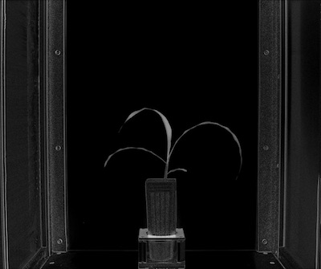

Next, the saturation channel is thresholded.
A [binary threshold](binary_threshold.md) can be performed on either light or dark objects in the image.

Tip: This step is often one that needs to be adjusted depending on the lighting and configurations of your camera system

```python
    # Threshold the Saturation image
    
    # Inputs:
    #   gray_img - Grayscale image data 
    #   threshold- Threshold value (between 0-255)
    #   max_value - Value to apply above threshold (255 = white) 
    #   object_type - 'light' (default) or 'dark'. If the object is lighter than the 
    #                 background then standard threshold is done. If the object is 
    #                 darker than the background then inverse thresholding is done. 
    s_thresh = pcv.threshold.binary(gray_img=s, threshold=30, max_value=255, object_type='light')
    
```

**Figure 3.** Thresholded saturation channel image (Figure 2). Remaining objects are in white.

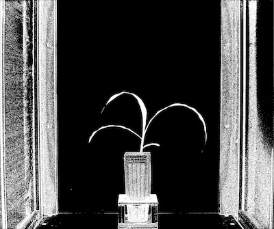

Again, depending on the lighting it will be possible to remove more/less background.
A [median blur](median_blur.md) can be used to remove noise.

Tip: Fill and median blur type steps should be used as sparingly as possible. Depending on the plant type (esp. grasses with thin leaves that often twist)
you can lose plant material with a median blur that is too harsh.

```python
    # Median Blur
    
    # Inputs: 
    #   gray_img - Grayscale image data 
    #   ksize - Kernel size (integer or tuple), (ksize, ksize) box if integer input,
    #           (n, m) box if tuple input 
    s_mblur = pcv.median_blur(gray_img=s_thresh, ksize=5)
    s_cnt = pcv.median_blur(gray_img=s_thresh, ksize=5)
    
```

**Figure 4.** Thresholded saturation channel image with median blur.

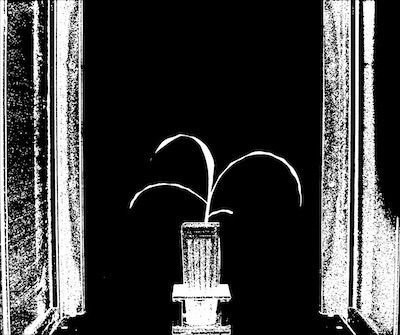

Here is where the workflow branches.
We convert the [RGB image to LAB](rgb2lab.md) color space and extract the blue-yellow channel.
This image is again thresholded and there is an optional [fill](fill.md) step that wasn't needed in this workflow.

```python
    # Convert RGB to LAB and extract the blue channel
    
    # Input:
    #   rgb_img - RGB image data 
    #   channel- Split by 'l' (lightness), 'a' (green-magenta), or 'b' (blue-yellow) channel
    b = pcv.rgb2gray_lab(rgb_img=img, channel='b')
    
    # Threshold the blue image
    b_thresh = pcv.threshold.binary(gray_img=b, threshold=129, max_value=255, object_type='light')
    b_cnt = pcv.threshold.binary(gray_img=b, threshold=19, max_value=255, object_type='light')
    
```

**Figure 5.** (Top) Blue-yellow channel from LAB color space from original image. (Bottom) Thresholded blue-yellow channel image.

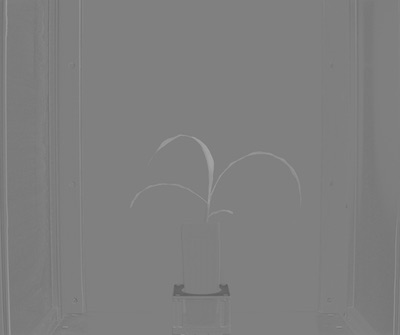

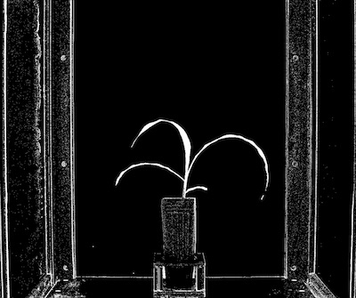

Join the binary images from Figure 4 and Figure 5 with the [logical and](logical_and.md) function.

```python
    # Join the thresholded saturation and blue-yellow images
    
    # Inputs: 
    #   bin_img1 - Binary image data to be compared to bin_img2
    #   bin_img2 - Binary image data to be compared to bin_img1
    bs = pcv.logical_and(bin_img1=s_mblur, bin_img2=b_cnt)
    
```

**Figure 6.** Joined binary images (Figure 4 and Figure 5).

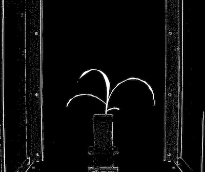

Next, apply the binary image (Figure 6) as an image [mask](apply_mask.md) over the original image.
The purpose of this mask is to exclude as much background with simple thresholding without leaving out plant material.

```python
    # Apply Mask (for VIS images, mask_color=white)
    
    # Inputs:
    #   img - RGB image data 
    #   mask - Binary mask image data 
    #   mask_color - 'white' or 'black' 
    masked = pcv.apply_mask(img=img, mask=bs, mack_color='white')
    
```

**Figure 7.** Masked image with background removed.

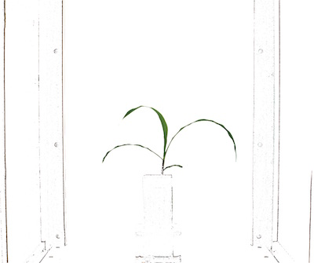

Now we need to [identify the objects](find_objects.md) (called contours in OpenCV) within the image.

```python
    # Identify objects
    
    # Inputs: 
    #   img - RGB or grayscale image data for plotting 
    #   mask - Binary mask used for detecting contours 
    id_objects,obj_hierarchy = pcv.find_objects(img=masked, mask=bs)
    
```

**Figure 8.** Here the objects (purple) are identified from the image from Figure 10.
Even the spaces within an object are colored, but will have different hierarchy values.

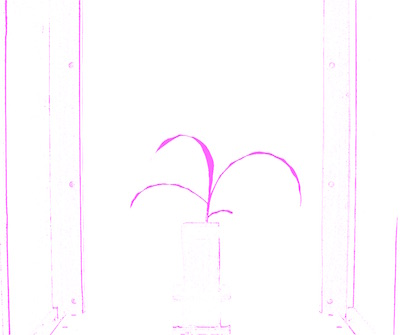

Next, a [rectangular region of interest](roi_rectangle.md) is defined (this can be made on the fly).

```python
    # Define ROI
    # Inputs: 
    #   img - RGB or grayscale image to plot the ROI on 
    #   x - The x-coordinate of the upper left corner of the rectangle 
    #   y - The y-coordinate of the upper left corner of the rectangle 
    #   h - The height of the rectangle 
    #   w - The width of the rectangle 
    roi1, roi_hierarchy= pcv.roi.rectangle(img=img, x=600, y=450, h=600, w=700)
    
```

**Figure 9.** Region of interest drawn onto image. 

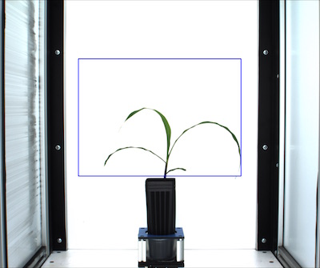

Once the region of interest is defined you can decide to keep everything overlapping with the region of interest
or cut the objects to the shape of the [region of interest](roi_objects.md).

```python
    # Decide which objects to keep
    
    # Inputs:
    #    img            = img to display kept objects
    #    roi_contour    = contour of roi, output from any ROI function
    #    roi_hierarchy  = contour of roi, output from any ROI function
    #    object_contour = contours of objects, output from pcv.find_objects function
    #    obj_hierarchy  = hierarchy of objects, output from pcv.find_objects function
    #    roi_type       = 'partial' (default, for partially inside), 'cutto', or 
    #    'largest' (keep only largest contour)
    roi_objects, hierarchy, kept_mask, obj_area = pcv.roi_objects(img=img, roi_contour=roi1, 
                                                                  roi_hierarchy=roi_hierarchy,
                                                                  object_contour=id_objects,
                                                                  obj_hierarchy=obj_hierarchy,
                                                                  roi_type='partial')
    
```

**Figure 10.** Kept objects (green) drawn onto image.

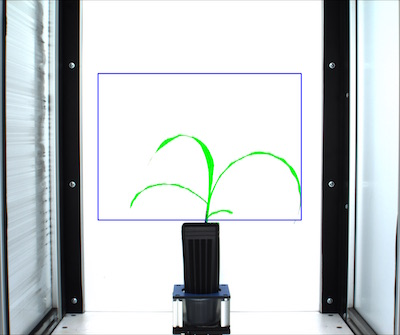

The isolated objects now should all be plant material. There, can however, 
be more than one object that makes up a plant, since sometimes leaves twist 
making them appear in images as separate objects. Therefore, in order for
shape analysis to perform properly the plant objects need to be combined into 
one object using the [combine objects](object_composition.md) function.

```python
    # Object combine kept objects
    
    # Inputs:
    #   img - RGB or grayscale image data for plotting 
    #   contours - Contour list 
    #   hierarchy - Contour hierarchy array 
    obj, mask = pcv.object_composition(img=img, contours=roi_objects, hierarchy=hierarchy)
    
```

**Figure 11.** Outline (blue) of combined objects on the image. 

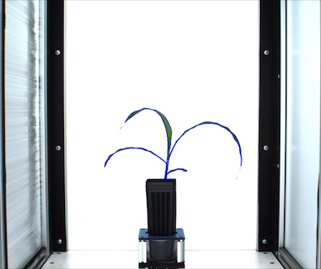

The next step is to analyze the plant object for traits such as [horizontal height](analyze_bound_horizontal.md),
[shape](analyze_shape.md), or [color](analyze_color.md).

```python

    ############### Analysis ################  
  
    # Find shape properties, output shape image (optional)
    
    # Inputs:
    #   img - RGB or grayscale image data 
    #   obj- Single or grouped contour object
    #   mask - Binary image mask to use as mask for moments analysis 
    #   label - Optional label parameter, modifies the variable name of observations recorded 
    shape_img = pcv.analyze_object(img=img, obj=obj, mask=mask, label="default")
    
    # Shape properties relative to user boundary line (optional)
    
    # Inputs:
    #   img - RGB or grayscale image data 
    #   obj - Single or grouped contour object 
    #   mask - Binary mask of selected contours 
    #   line_position - Position of boundary line (a value of 0 would draw a line 
    #                   through the bottom of the image) 
    #   label - Optional label parameter, modifies the variable name of observations recorded 
    boundary_img1 = pcv.analyze_bound_horizontal(img=img, obj=obj, mask=mask, 
                                                     line_position=1680, label="default")
    
    # Determine color properties: Histograms, Color Slices, output color analyzed histogram (optional)
    
    # Inputs:
    #   rgb_img - RGB image data
    #   mask - Binary mask of selected contours 
    #   hist_plot_type - None (default), 'all', 'rgb', 'lab', or 'hsv'
    #   label - Optional label parameter, modifies the variable name of observations recorded 
    color_histogram = pcv.analyze_color(rgb_img=img, mask=kept_mask, hist_plot_type='all', label="default")

    # Pseudocolor the grayscale image
    
    # Inputs:
    #     gray_img - Grayscale image data
    #     obj - Single or grouped contour object (optional), if provided the pseudocolored image gets 
    #           cropped down to the region of interest.
    #     mask - Binary mask (optional) 
    #     background - Background color/type. Options are "image" (gray_img, default), "white", or "black". A mask 
    #                  must be supplied.
    #     cmap - Colormap
    #     min_value - Minimum value for range of interest
    #     max_value - Maximum value for range of interest
    #     dpi - Dots per inch for image if printed out (optional, if dpi=None then the default is set to 100 dpi).
    #     axes - If False then the title, x-axis, and y-axis won't be displayed (default axes=True).
    #     colorbar - If False then the colorbar won't be displayed (default colorbar=True)
    pseudocolored_img = pcv.visualize.pseudocolor(gray_img=s, mask=kept_mask, cmap='jet')

    # Write shape and color data to results file
    pcv.outputs.save_results(filename=args.result)
    
    # Will will print out results again, so clear the outputs before running NIR analysis 
    pcv.outputs.clear()
    
```

**Figure 12.** Shape analysis output image.

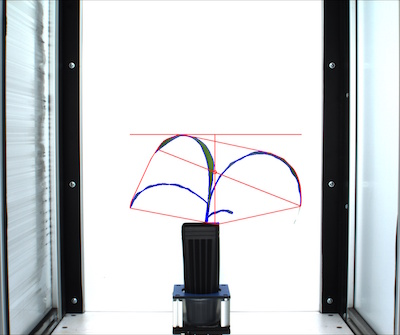

**Figure 13.** Boundary line output image.

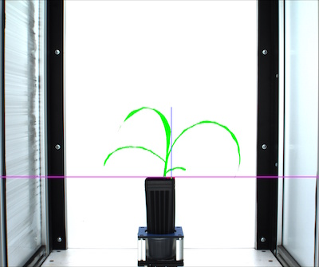

**Figure 14.** Pseudocolored image (based on value channel).

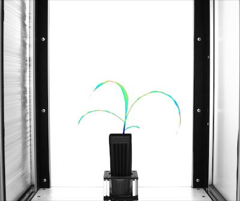

The next step is to [get the matching NIR](get_nir.md) image, [resize](transform_resize.md), and place the VIS [mask](crop_position_mask.md) over it.

```python
    if args.coresult is not None:
        nirpath = pcv.get_nir(path,filename)
        nir, path1, filename1 = pcv.readimage(nirpath)
        nir2, path2, filename2 = pcv.readimage(nirpath)


    # Inputs:
    #   img - RGB or grayscale image to resize
    #   resize_x - resize number in the x dimension
    #   resize_y - resize number in the y dimension 
    nmask = pcv.transform.resize_factor(img=mask, factors=(0.28, 0.28), interpolation="auto")
    
    
    # Inputs:
    #   img - RGB or grayscale image data 
    #   mask - Binary image to be used as a mask 
    #   x - Amount to push in the vertical direction
    #   y - Amount to push in the horizontal direction
    #   v_pos - Push from the 'top' (default) or 'bottom' in the vertical direction
    #   h_pos - Push from the 'right' (default) or 'left' in the horizontal direction 
    newmask = pcv.crop_position_mask(img=nir, mask=nmask, x=40, y=3, 
                                     v_pos="top", h_pos="right")
    
```

**Figure 15.** Resized image.

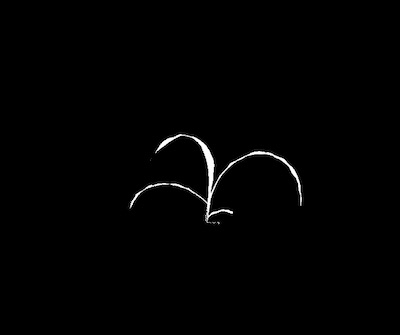

**Figure 16.** VIS mask on image.


```python
    nir_objects, nir_hierarchy = pcv.find_objects(img=nir, mask=newmask)
    
```

**Figure 17.** Find objects.

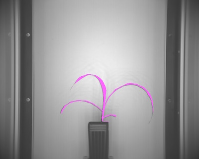

```python
    #combine objects
    nir_combined, nir_combinedmask = pcv.object_composition(img=nir, contours=nir_objects, 
                                                            hierarchy=nir_hierarchy)
    
```

**Figure 18.** Combine objects.

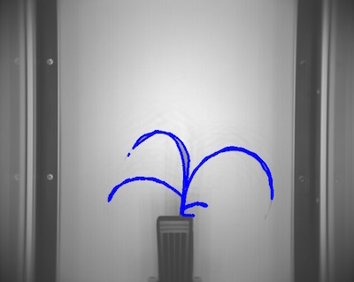

```python
    # Inputs: 
    #   gray_img - 8 or 16-bit grayscale image data 
    #   mask - Binary mask made from selected contours 
    #   bins - Number of classes to divide spectrum into
    #   histplot - If True then plots histogram of intensity values, (default False) 
    #   label - Optional label parameter, modifies the variable name of observations recorded 
    nir_hist = pcv.analyze_nir_intensity(gray_img=nir2, mask=nir_combinedmask, 
                                         bins=256, histplot=True, label="default")
                                         
    nir_shape_image = pcv.analyze_object(img=nir2, obj=nir_combined, mask=nir_combinedmask, label="NIR")

    # Save out the NIR histogram
    pcv.print_image(img=nir_hist, filename=os.path.join(pcv.params.debug_outdir, 'nirhist.png'))

    # Save out the image with shape data
    pcv.print_image(img=nir_shape_image, filename=os.path.join(pcv.params.debug_outdir, 'shape.png'))
    
```

**Figure 19.** NIR signal histogram.

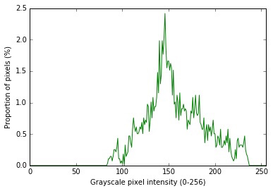

**Figure 20.** NIR shapes.

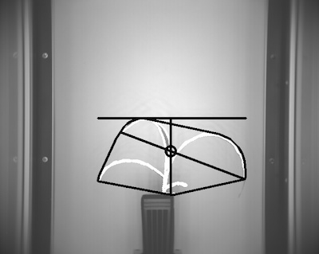

Write co-result data out to a file.

```python
    pcv.outputs.save_results(filename=args.coresult)
    
if __name__ == '__main__':
    main()
    
```

To deploy a workflow over a full image set please see tutorial on 
[workflow parallelization](pipeline_parallel.md).

## VIS NIR Script
In the terminal:

```
./workflowname.py -i testimg.png -o ./output-images -r results.txt -w -D 'print'

```

*  Always test workflows (preferably with -D flag set to 'print') before running over a full image set

Python script: 

```python
#!/usr/bin/env python
import os
import argparse
from plantcv import plantcv as pcv

### Parse command-line arguments
def options():
    parser = argparse.ArgumentParser(description="Imaging processing with opencv")
    parser.add_argument("-i", "--image", help="Input image file.", required=True)
    parser.add_argument("-o", "--outdir", help="Output directory for image files.", required=False)
    parser.add_argument("-r","--result", help="result file.", required= False )
    parser.add_argument("-r2","--coresult", help="result file.", required= False )
    parser.add_argument("-w","--writeimg", help="write out images.", default=False)
    parser.add_argument("-D", "--debug", help="Turn on debug, prints intermediate images.", default=None)
    args = parser.parse_args()
    return args

### Main workflow
def main():
    # Get options
    args = options()
    
    pcv.params.debug=args.debug #set debug mode
    pcv.params.debug_outdir=args.outdir #set output directory
    
    # Read image
    img, path, filename = pcv.readimage(filename=args.image)

    # Convert RGB to HSV and extract the saturation channel
    s = pcv.rgb2gray_hsv(rgb_img=img, channel='s')

    # Threshold the Saturation image
    s_thresh = pcv.threshold.binary(gray_img=s, threshold=30, max_value=255, object_type='light')

    # Median Blur
    s_mblur = pcv.median_blur(gray_img=s_thresh, ksize=5)
    s_cnt = pcv.median_blur(gray_img=s_thresh, ksize=5)

    # Convert RGB to LAB and extract the blue channel
    b = pcv.rgb2gray_lab(rgb_img=img, channel='b')
    
    # Threshold the blue image
    b_thresh = pcv.threshold.binary(gray_img=b, threshold=129, max_value=255, object_type='light')
    b_cnt = pcv.threshold.binary(gray_img=b, threshold=19, max_value=255, object_type='light')

    # Join the thresholded saturation and blue-yellow images
    bs = pcv.logical_and(bin_img1=s_mblur, bin_img2=b_cnt)

    # Apply Mask (for VIS images, mask_color=white)
    masked = pcv.apply_mask(img=img, mask=bs, mask_color='white')

    # Identify objects
    id_objects,obj_hierarchy = pcv.find_objects(img=masked, mask=bs)

    # Define ROI
    roi1, roi_hierarchy= pcv.roi.rectangle(img=img, x=600, y=450, h=600, w=700)

    # Decide which objects to keep
    roi_objects, hierarchy, kept_mask, obj_area = pcv.roi_objects(img=img, roi_contour=roi1, 
                                                                  roi_hierarchy=roi_hierarchy,
                                                                  object_contour=id_objects,
                                                                  obj_hierarchy=obj_hierarchy,
                                                                  roi_type='partial')
    
    # Object combine kept objects
    obj, mask = pcv.object_composition(img=img, contours=roi_objects, hierarchy=hierarchy)

    ############### Analysis ################  
  
    # Find shape properties, output shape image (optional)
    shape_img = pcv.analyze_object(img=img, obj=obj, mask=mask, label="default")
    
    # Shape properties relative to user boundary line (optional)
    boundary_img1 = pcv.analyze_bound_horizontal(img=img, obj=obj, mask=mask, 
                                                 line_position=1680, label="default")
    
    # Determine color properties: Histograms, Color Slices, output color analyzed histogram (optional)
    color_histogram = pcv.analyze_color(rgb_img=img, mask=kept_mask, hist_plot_type='all', label="default")

    # Pseudocolor the grayscale image
    pseudocolored_img = pcv.visualize.pseudocolor(gray_img=s, mask=kept_mask, cmap='jet')

    # Write shape and color data to results file
    pcv.outputs.save_results(filename=args.result)
    
    # Will will print out results again, so clear the outputs before running NIR analysis 
    pcv.outputs.clear()
    
    if args.coresult is not None:
        nirpath = pcv.get_nir(path,filename)
        nir, path1, filename1 = pcv.readimage(nirpath)
        nir2, path2, filename2 = pcv.readimage(nirpath)

    nmask = pcv.transform.resize_factor(img=mask, factors=(0.28, 0.28), interpolation="auto")

    newmask = pcv.crop_position_mask(img=nir, mask=nmask, x=40, y=3, 
                                 v_pos="top", h_pos="right")
    
    nir_objects, nir_hierarchy = pcv.find_objects(img=nir, mask=newmask)

    #combine objects
    nir_combined, nir_combinedmask = pcv.object_composition(img=nir, contours=nir_objects, 
                                                        hierarchy=nir_hierarchy)

    # Analyze NIR intensity and object shape 
    nir_hist = pcv.analyze_nir_intensity(gray_img=nir2, mask=nir_combinedmask, bins=256, histplot=True, label="default")
    nir_shape_image = pcv.analyze_object(img=nir2, obj=nir_combined, mask=nir_combinedmask, label="NIR")

    # Save out the NIR histogram
    pcv.print_image(nir_imgs[0], os.path.join(pcv.params.debug_outdir, 'nirhist.png'))

    # Save out the image with shape data
    pcv.print_image(nir_shape_image, os.path.join(pcv.params.debug_outdir, 'shape.png'))

    # Save data to coresult file 
    pcv.outputs.save_results(filename=args.coresult)
    
if __name__ == '__main__':
  main()
  
```
